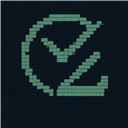

# 🎯 Zenith - Peak Productivity Timer Chrome Extension

<div align="center">



**Elevate Your Focus, Reach Your Peak Productivity**

A powerful Chrome extension designed for students, researchers, developers, and professionals who want to maximize their focus and track their digital productivity in real-time.

**[📥 Install Now from Chrome Web Store](https://chromewebstore.google.com/detail/zenith-peak-productivity/ooajgilhjmkhlljfilhjjpoaacldpdbh)**

[](https://chromewebstore.google.com/detail/zenith-peak-productivity/ooajgilhjmkhlljfilhjjpoaacldpdbh)
[](https://developer.chrome.com/docs/extensions/mv3/)
[](https://developer.mozilla.org/en-US/docs/Web/JavaScript)
[](https://opensource.org/licenses/MIT)
[](https://anniim21.github.io/zenith/privacy-policy.html)

</div>

## 🚀 Why Zenith Chrome Extension?

Perfect for **students**, **researchers**, **developers**, and **professionals** who want to:

✅ **Stay Focused** - Eliminate distractions with scientifically-proven timer techniques  
✅ **Track Real Browsing** - Monitor actual time spent on websites during work sessions  
✅ **Boost Productivity** - Get detailed analytics on your digital work patterns  
✅ **Study Smarter** - Use Pomodoro and Deep Work sessions for maximum learning efficiency  
✅ **Research Better** - Track time across different research sources and maintain focus  
✅ **Work Efficiently** - Understand your productivity patterns with real-time data

## ✨ Key Features

### 🎯 **Smart Timer System**

- **Session Presets**: Pomodoro (25min), Deep Work (45min), Quick Focus (15min), Long Session (90min)
- **Custom Timers**: Set your own focus and break durations (1-180 minutes)
- **Pause & Resume**: Full control over your timer sessions
- **Background Operation**: Timer continues running even when popup is closed

### 📊 **Real-Time Browser Tracking**

- **Live Activity Monitoring**: Track websites visited and time spent
- **Tab Switch Detection**: Monitor focus patterns and distractions
- **Session Reports**: Detailed analytics after each tracking session
- **Productivity Scoring**: Smart categorization of productive vs distracting sites

### 🎨 **Beautiful Modern Interface**

- **Clean Design**: Intuitive and distraction-free interface
- **Gradient Themes**: Beautiful gradients with glassmorphism effects
- **Responsive Layout**: Works perfectly in Chrome extension popup
- **Real-time Updates**: Live timer and tracking status updates

### 🔧 **Advanced Controls**

- **Always Accessible**: Quick access from Chrome toolbar
- **Persistent State**: Maintains timer and tracking state across browser sessions
- **Smart Notifications**: Alerts when timer sessions complete
- **Badge Indicators**: Extension icon shows current timer status

## 🔮 Upcoming Features

### 🚫 **Focus Lock Mode** _(Coming Soon)_

- **Tab Switching Prevention**: Block tab switching during focus sessions
- **Selective Whitelist**: Allow only essential tabs (email, work tools, reference materials)
- **Full Commitment Mode**: Maximum focus with minimal distractions
- **Smart Exceptions**: Configurable allowed domains for research and work

## 📦 Installation

### 🚀 **Method 1: Chrome Web Store (Recommended)**

**[📥 Install from Chrome Web Store](https://chromewebstore.google.com/detail/zenith-peak-productivity/ooajgilhjmkhlljfilhjjpoaacldpdbh)**

1. **Click the link above** or search "Zenith Peak Productivity" in Chrome Web Store
2. **Click "Add to Chrome"** to install the extension
3. **Pin the extension** to your toolbar for easy access
4. **Start your first session** by clicking the Zenith icon!

### 🛠️ **Method 2: Development Installation**

For developers who want to contribute or customize:

1. **Download or Clone** this repository:

   ```bash
   git clone https://github.com/AnniiiM21/zenith.git
   cd zenith
   ```

2. **Load in Chrome**:

   - Open Chrome and go to `chrome://extensions/`
   - Enable "Developer mode" (toggle in top right)
   - Click "Load unpacked"
   - Select the project root directory

3. **Start Using**:
   - Look for the Zenith icon in your Chrome toolbar
   - Click it to open the timer and start your first session!

## 🎮 How to Use

### Starting Your First Session

1. **Open Zenith**: Click the Zenith icon in your Chrome toolbar
2. **Choose a Preset**: Select from Pomodoro, Deep Work, Quick Focus, or Long Session
3. **Start Timer**: Click the "Start" button to begin your focus session
4. **Track Activity**: Enable browser tracking to monitor your productivity

### Custom Timer Setup

1. **Click "Set"**: Press the purple "Set" button in the timer controls
2. **Configure Times**:
   - Focus Time: 1-180 minutes
   - Break Time: 1-60 minutes
3. **Confirm**: Click "Confirm" to apply your custom timer

### Browser Tracking

1. **Switch to Analytics Tab**: Click "Analytics" in the navigation
2. **Start Tracking**: Click "▶️ Start" to begin monitoring your browsing
3. **View Live Stats**: See real-time data on sites visited and tab switches
4. **Generate Reports**: Stop tracking to get detailed session analytics

### Timer Controls

- **Start/Pause**: Begin a new timer or pause/resume current session
- **Set**: Configure custom focus and break durations
- **Reset**: Stop current timer and reset to original duration

## 🛠️ Technical Details

### Built With

- **Manifest V3**: Latest Chrome extension platform
- **Vanilla JavaScript**: Fast and lightweight, no framework dependencies
- **Chrome APIs**: Storage, Alarms, Tabs, and Notifications
- **Webpack**: Module bundling and optimization
- **Modern CSS**: Gradients, glassmorphism, and responsive design

### Architecture

- **Background Service Worker**: Handles timer logic and data persistence
- **Popup Interface**: Main user interface with timer and analytics
- **Content Scripts**: Website interaction and activity tracking
- **Chrome Storage**: Persistent data storage across sessions

### Privacy & Security

- **Local Storage Only**: All data stays on your device
- **No External Servers**: No data sent to third parties
- **Minimal Permissions**: Only necessary Chrome APIs used
- **Open Source**: Full transparency of all code

## 🤝 Contributing

Contributions are welcome! Feel free to:

- Report bugs or request features via GitHub Issues
- Submit pull requests for improvements
- Share feedback and suggestions
- Help with testing and documentation

## 📄 License

This project is licensed under the MIT License - see the [LICENSE](LICENSE) file for details.

## 🔗 Links

- **[🌐 Chrome Web Store](https://chromewebstore.google.com/detail/zenith-peak-productivity/ooajgilhjmkhlljfilhjjpoaacldpdbh)** - Install the extension
- **[🔒 Privacy Policy](https://anniim21.github.io/zenith/privacy-policy.html)** - How we protect your data
- **[📖 GitHub Repository](https://github.com/AnniiiM21/zenith)** - Source code and contributions
- **[🐛 Report Issues](https://github.com/AnniiiM21/zenith/issues)** - Bug reports and feature requests

## 👨‍💻 About the Developer

**Made by the unfocused engineer Aniruddha**  
**from LifexInvader**

Zenith was created to solve my own productivity challenges as a developer who struggled with focus and digital distractions. If this extension helps you achieve better focus and productivity, I've accomplished my goal!

---

<div align="center">

**⚡ Ready to reach your productivity peak? ⚡**

**[📥 Install Zenith from Chrome Web Store](https://chromewebstore.google.com/detail/zenith-peak-productivity/ooajgilhjmkhlljfilhjjpoaacldpdbh)**

_Start your focused journey today!_


</div>
